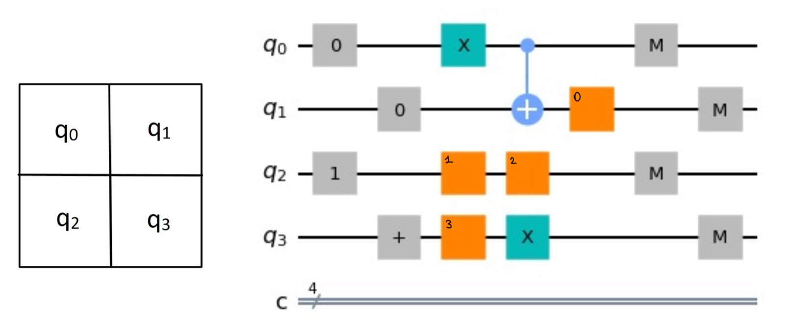
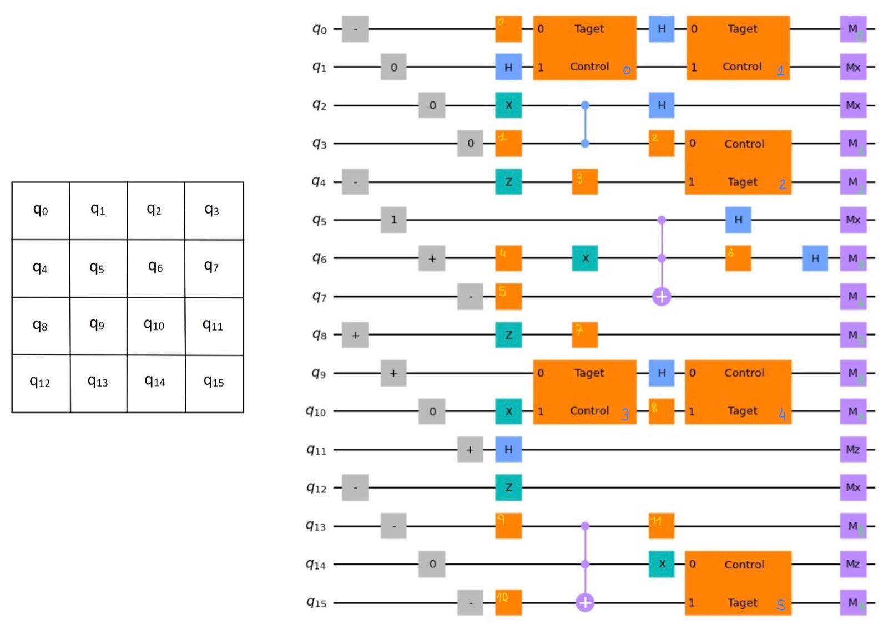

# HQ-Hack 2022 - Quantum sudoku

## Team members
    Lisa Bombieri
    Tina Radkohl
    Francesco Pinzauti
    Kartik Sharma
    Vishal Mandal

# The game: quantum sudoku
In this game the player's goal is to solve a sudoku using quantum circuits.

## Level 1 - warm up 
In the first level, the player has to solve a 2x2 Sudoku using 0 and 1. A quantum circuit is given to the player with a given input state, fixed quantum gates and some additional single-qubit gates the user has to choose to solve the sudoku. These gates can be chosen between Hadamard, Z-gate, X-gate and Identity.
The verification of the solution is done using a simulator which runs the circuits 1024 times, the sukodu is considered completed if the right outcome is obtained with probability 100%. The output will be True if the Sudoku is solved successfully.
We implement the following quantum sudoku for this level:

The solution is given by the gates X, X, I and H (in order), which gives indeed the result 1001 with 100% probability.

## Level 2 
In the second level the players have to solve a 4x4 Sudoku, using numbers from 0 to 3. The quantum enconding works as following:
0 --> \ket{0},  1 --> \ket{1}, 2 -->  \ket{+} and 3 --> \ket{-}. In this case the players can choose both single-qubit gates (Hadamard, Z-gate, X-gate and Identity), two-qubit gates (Cnot, Cz) and also the measurement basis (z-basis and x-basis).
The sudoku we invented is shown below:

The right solution is given by:
single qubit gates = 'Z', 'H', 'H', 'H', 'H', 'H', 'X', 'I', 'H', 'H', 'Z', 'X'
two qubit gates ='CZ', 'CX', 'CX', 'CZ', 'CZ', 'CZ'
measurement basis = 'Mz', 'Mz', 'Mz', 'Mz', 'Mx', 'Mx',  'Mz', 'Mx', 'Mz', 'Mx'
which gives the result 1100001100111100 (starting from q0 to the right) with 100% probability.

# Instructions to run the game

* form interface import play
* play()
* choose level 1 (level 2 in progress)
* choose the gates following the insructions in the terminal
* see if your result is correct

# Level 2
To be properly implemented in the interface, if you wnat to try it follow the instructions: 
* use the notebook "sudoku_4x4_level1.ipynb" to visualize the empty sudoku and the associated circuit you have to edit
* use the notebok "sudoku_4x4_level1_cod_measurement.ipynb" to insert your gates and measurements choices, run completed circuit and see if your solution is the right one. 

## Future developments
This game can be extended in many ways adding more difficult 4x4 sudoku or 6x6 sudoku using also the Y basis for the encoding. 
